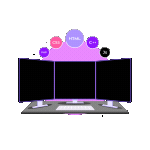
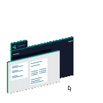
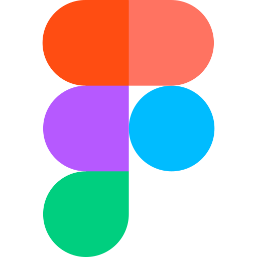
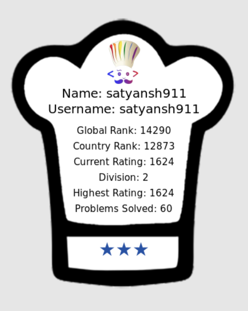

  

<h1 align="center"><b><i>Hello, I'm Satyansh Singh</i></b> 

</h1>

  

---
<h1 align="center"><i> About Me</h1>

I am a **_Full-Stack Developer_** dedicated to continuous web evolution, with a primary focus on **_system design_** and the creation of high-quality digital experiences. My learning journey has been driven by a passion for <u>solving complex problems and building scalable, high-performance applications that bridge technical efficiency with intuitive interfaces</u>. I have cultivated a deep interest in **_Backend Engineering, Distributed Systems, and DevOps_**, focusing on the structured design of large-scale systems through rigorous requirements analysis and capacity estimation. My foundation is rooted in a strong command of algorithms and data structures, evidenced by solving over **500** coding problems across various competitive programming platforms. Beyond core development, I actively explore high-level architecture and scalability fundamentals to deliver exceptional results in dynamic environments.
</i>
 

---

<h1 align="center"><b><i> Tech Stack</h1>

<h2 align="center" >Web Development</h2>

<table style="background-color: white; color: white; border: white; border-radius: 15px; overflow: hidden;">
  <thead>
    <tr>
      <th colspan="8" align="center" style="color: white;"><b><i>Frontend</i></b></th>
    </tr>
  </thead>
  <tbody>
    <tr>
      <td align="center" style="border: none;">
        
         Next.js
      </td>
      <td align="center" style="border: none;">
        
         Tailwind CSS
      </td>
      <td align="center" style="border: none;">
        
         React
      </td>
      <td align="center" style="border: none;">
        
         TypeScript
      </td>
      <td align="center" style="border: none;">
        
         JavaScript
      </td>
      <td align="center" style="border: none;">
        
         jQuery
      </td>
      <td align="center" style="border: none;">
        
         HTML
      </td>
      <td align="center" style="border: none;">
        
         CSS
      </td>
    </tr>
  </tbody>
</table>

<table style="background-color: white; color: white; border: white; border-radius: 15px; overflow: hidden;">
  <thead>
    <tr>
      <th colspan="4" align="center" style="color: white;"><b><i>Backend</th>
    </tr>
  </thead>
  <tbody>
    <tr>
      <td align="center" style="border: none;">
         Node.js
      </td>
      <td align="center" style="border: none;">
         Express
      </td>
      <td align="center" style="border: none;">
         gRPC
      </td>
    </tr>
  </tbody>
</table>

<table style="background-color: white; color: white; border: white; border-radius: 15px; overflow: hidden;">
  <thead>
    <tr>
      <th colspan="4" align="center" style="color: white;"><b><i>Database</th>
    </tr>
  </thead>
  <tbody>
    <tr>
      <td align="center" style="border: none;">
         MySQL
      </td>
      <td align="center" style="border: none;">
         MongoDB
      </td>
      <td align="center" style="border: none;">
         PostgreSQL
      </td>
      <td align="center" style="border: none;">
         Redis
      </td>
    </tr>
  </tbody>
</table>

<h2 align="center"><b><i>Cloud Computing & DevOps</i></b></h2>

<table style="background-color: white; color: white; border: white; border-radius: 15px; overflow: hidden;">
  <thead>
    <tr>
      <th colspan="4" align="center" style="color: white;"><b><i>Containerization & Orchestration</th>
    </tr>
  </thead>
  <tbody>
    <tr>
      <td align="center" style="border: none;">
         Docker
      </td>
      <td align="center" style="border: none;">
         Kubernetes
      </td>
      <td align="center" style="border: none;">
         Helm
      </td>
      <td align="center" style="border: none;">
         Skaffold
      </td>
    </tr>
  </tbody>
</table>

  <table style="background-color: white; color: white; border: white; border-radius: 15px; overflow: hidden;">
    <thead>
      <tr>
        <th colspan="4" align="center" style="color: white;"><b><i>Cloud Providers</th>
      </tr>
    </thead>
    <tbody>
      <tr>
        <td align="center" style="border: none; padding: 12px;">
           Azure
        </td>
        <td align="center" style="border: none; padding: 12px;">
           GCP
        </td>
        <td align="center" style="border: none; padding: 12px;">
           AWS
        </td>
      </tr>
    </tbody>
  </table>

<table style="background-color: white; color: white; border: white; border-radius: 15px; overflow: hidden;">
  <thead>
    <tr>
      <th colspan="2" align="center" style="color: white;"><b><i>Infrastructure as Code</th>
    </tr>
  </thead>
  <tbody>
    <tr>
      <td align="center" style="border: none;">
         Terraform
      </td>
        <td align="center" style="border: none;">
         Ansible
       </td>
    </tr>
  </tbody>
</table>

<h2 align="center"><b><i> Tools & Prompt Engineering</i></b></h2>

 <table style="background-color: white; color: white; border: white; border-radius: 15px; overflow: hidden;">
  <thead>
    <tr>
      <th colspan="6" align="center" style="color: white;"><b><i>AI & Design Tools</th>
    </tr>
  </thead>
  <tbody>
    <tr>
      <td align="center" style="border: none;">
         ChatGPT
      </td>
       <td align="center" style="border: none;">
         Claude (Anthropic)
      </td>
      <td align="center" style="border: none;">
        
         Google Gemini
      </td>
      <td align="center" style="border: none;">
        
         Figma
      </td>
    </tr>
  </tbody>
</table>

---
<h1 align="center" >Git Stats</h1>

 
  
   
   
 

<table>
  <tr>
    <td>
      
    </td>
    <td>
      
    </td>
  </tr>
</table>

### **_GitHub Contribution Chart_**

 

---
<h1 align="center" >Coding Metrics & Profiles</h1>

| **LeetCode Stats** | **CodeChef Stats** | **Codeforces Stats** 
| :---: | :---: | :--: |
|  |   | <a href="https://codeforces.com/profile/Satyansh911"></a> |

| **Codolio DSA Stats** | **Codolio WebDev Stats** |
| :--: | :--: |
|  | 

---

<h1 align="center"><b><i> Let's Connect!</h1>

<table align="center">
  <thead>
    <tr>
      <th>Email</th>
    </tr>
  </thead>
  <tbody>
    <tr>
      <td align="center">
        <a href="mailto:satyanshofficial@gmail.com" target="_blank">
           
           
          satyanshofficial@gmail.com
        </a>
      </td>
    </tr>
  </tbody>
</table>

 

<h3>

<h3>  
 From <a href="https://github.com/satyansh911">Satyansh</a> | Let's innovate together! 
</i>
</h3>

</h3>

